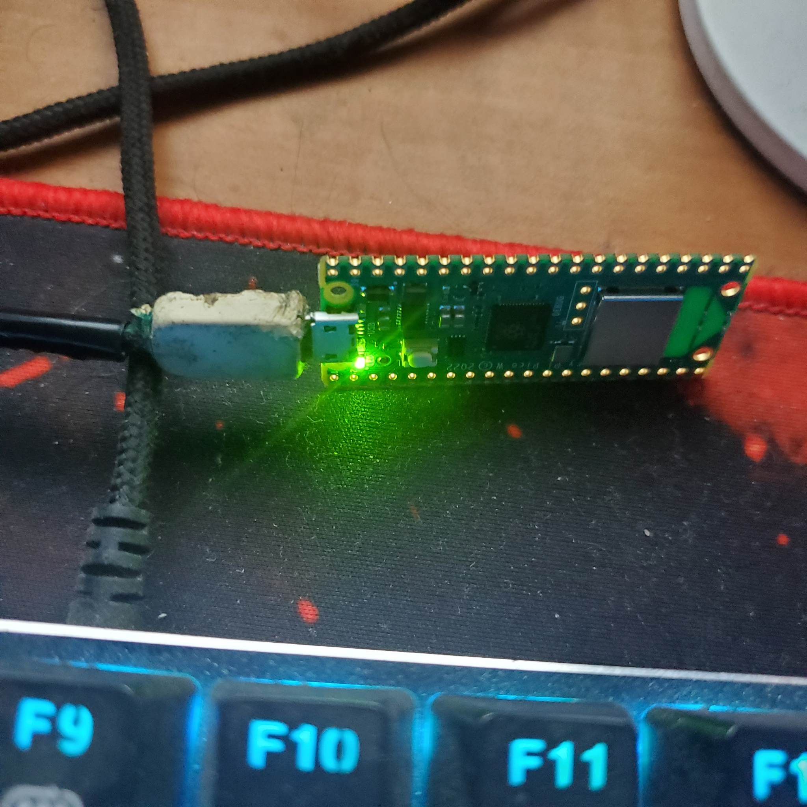
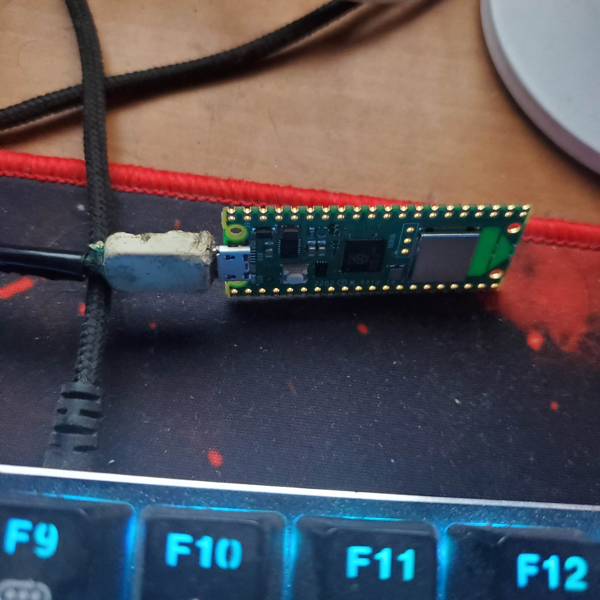

<pre>

	

Tecnológico Nacional de México
Instituto Tecnológico de Tijuana

Departamento de Sistemas y Computación
Ingeniería en Sistemas Computacionales

Semestre:
Enero - Junio 2023

Materia:
Lenguajes de interfaz

Docente:
M.C. Rene Solis Reyes 

Unidad:
3

Título del trabajo:
Ejercicios rasberry pico

Estudiante:
Duran Martinez Jesus Alejandro

	

</pre>

